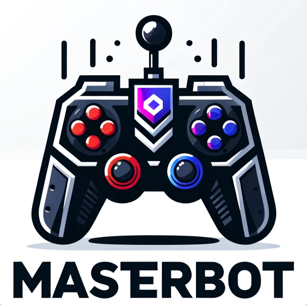

<p align="center">
  
</p>

<h1 align="center">Bot Experimental para Clash of Kings - The West 🎮🤖</h1>

Este projeto foi desenvolvido por mim, Jyan, quando eu tinha entre 17 e 18 anos, como forma de aprendizado prático em automação, visão computacional e manipulação de imagens com Python.

O bot foi criado especificamente para o jogo **Clash of Kings: The West**, com o objetivo de automatizar um mini game de cartas presente em uma masmorra. A proposta era simples: o bot identificava se cada carta virada continha um ataque ou uma recompensa, e clicava nos botões correspondentes ("Batalhar" ou "Coletar").

---

## 🧩 Como o bot funciona

- Localiza a janela do emulador e a traz para frente;
- Tira prints da tela;
- Analisa as imagens para encontrar elementos específicos;
- Clica automaticamente nos locais certos com base na programação.

A estrutura do projeto foi dividida em scripts auxiliares e diretórios de recursos. **Não há integração completa entre os arquivos**, ou seja, cada script executa uma função isolada e o uso requer conhecimento manual do fluxo. Esse projeto nunca foi finalizado, nem transformado em executável.

---

## 📁 Estrutura do projeto

```
Bot/
├── assets/               → Imagens base para comparação
├── cache/                → Dados temporários
├── clicks/               → Histórico dos cliques realizados
├── porcents/             → Imagens de barras e porcentagens
├── res/                  → Conjunto de imagens 1
├── res2/                 → Conjunto de imagens 2
├── scripts_ajudantes/    → Scripts auxiliares
├── bot_teste.py          → Script de testes com lógica parcial
├── main_bot.py           → Script principal de automação
├── redimencionar.py      → Script para redimensionar imagens
├── image_similarity_log.txt → Log de comparação de imagens
```

---

## ⚠️ Sobre uso e ética

Este projeto **não será atualizado nem distribuído para uso prático**, pois a automação de jogos pode violar os termos de uso e configurações legais. Mantenho este código como parte do meu histórico de aprendizado e evolução como desenvolvedor.

---

## 🎯 Intenção do projeto

O foco aqui não foi burlar regras, mas **entender como funcionam processos complexos** como OCR (reconhecimento óptico de caracteres), automação de cliques, leitura de tela e manipulação de janelas. Ter construído isso sozinho, na adolescência, foi uma experiência importante no meu desenvolvimento técnico e pessoal.

---

## 💬 Considerações  

Esse bot é parte da minha jornada como programador curioso e autodidata. Mesmo sendo um projeto antigo e imperfeito, representa um marco no meu aprendizado.

Se você chegou até aqui por curiosidade técnica ou para estudar algo semelhante (dentro de contextos legais e éticos), fique à vontade para explorar os arquivos e refletir sobre como aplicar esses conhecimentos de forma construtiva.
